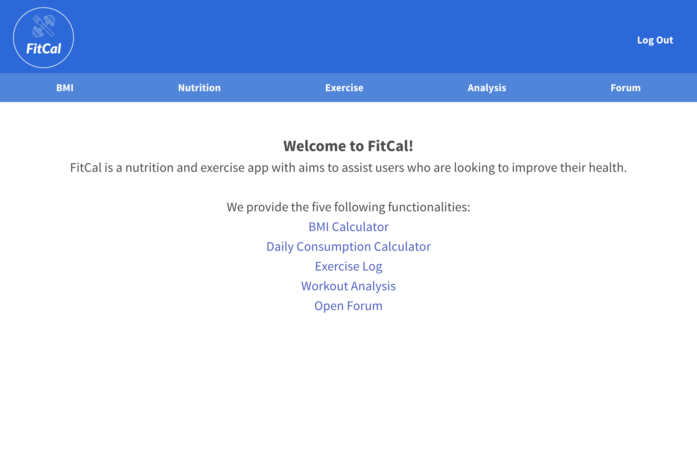

# FitCal 2.0

## Description

FitCal is a continuation for the FitCal project (linked below). It expands on its predecessor by adding new features and updating the design.

## Table of Contents

- [Usage](#usage)
- [Features](#features)
- [Credits](#credits)

## Usage

User can find the original deployed app at [FitCal](https://fitcalxxii.herokuapp.com/)

Repo for original app can be found at: (https://github.com/Robdom87/FitCalv2)

## Features added in v2.0
- Users can create an account using secure registration and login.
- User friendly BMI with easy to use slider mechanics and hight conversion into feet. 
- Redesigned exercise nutrition section with improved mechanics and clean look 
- Completely redesigned and improved exercise section with an ability create your own exercise routine.
- New analysis section to supplement user’s workout routine and keep all the necessary data easy to monitor fitness goals.
- And in addition, we added a completely new section for the registered user to participate in community forum (under development).
- The FitCal v2.0 is now compatible with mobile devices.  

*** IN DEVELOPMENT ***
Fully functioning community forum where users can engage in fitness and wellbeing discussions, comment and search for useful advices from other users. 

## Credits

Contributors: 
Dominguez, Robert  
Gomez, Christopher  
Sitnitski, Stan  
Yoon, Gi Won  
Chavez, Juan 
 
 

## Technologies Used:
- Bulma
- Jquery
- [API Ninjas](https://api-ninjas.com/)
  - Nutrition API
  - Exercise API
- Express.js
- MySQL
- Sequelize
- Handlebars
- Chart.js

## Screenshots
